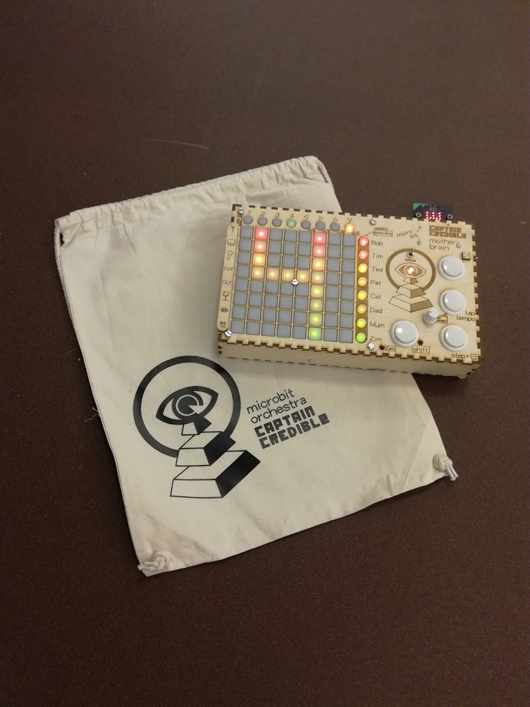

# pxt-motherbrain

This repository is for setting up a microbit to function with the "motherbrain" controller/conductor for the micro:bit orchestra:

The code works in conjuntion with an atmega32u4 programmed with this code:
https://github.com/CaptainCredible/MotherBrain

The micro:bit receives a pulse on one of the pins that serves as an interrupt to cause it to request data from the AVR via i2c ( this is because the micro:bit can't be set up as an i2c slave ). The AVR sends data to the micro:bit wich simply reformats it and conveys it via radio messages to the orchestra.

## TODO

- [ ] Add a reference for your blocks here
- [ ] Add "icon.png" image (300x200) in the root folder
- [ ] Add "- beta" to the GitHub project description if you are still iterating it.
- [ ] Turn on your automated build on https://travis-ci.org
- [ ] Use "pxt bump" to create a tagged release on GitHub
- [ ] Get your package reviewed and approved https://makecode.microbit.org/packages/approval

Read more at https://makecode.microbit.org/packages/build-your-own

## License
MIT

## Supported targets

* for PXT/microbit
(The metadata above is needed for package search.)

